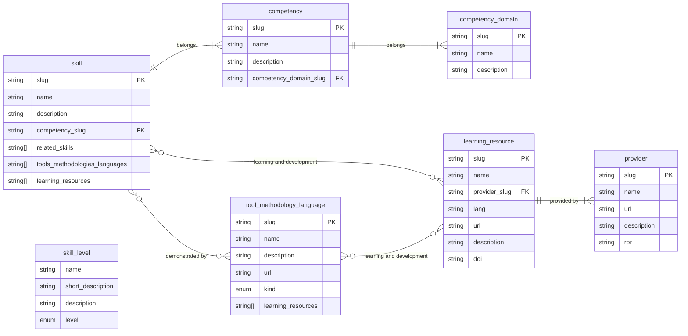

# DIgital REsearch CompeTencies (DIRECT) Framework

This work is part of the [DIRECT project](https://github.com/direct-framework). This reposiroty contains the definition a competencies framework for digital Research Technology Professionals (dRPTs).

The DIgital REsearch CompeTencies (DIRECT) framework helps classify and describe the wide range of technical and non-technical skills used across various digital research roles. These include researchers, research software engineers (RSEs), data specialists, group leads, principal investigators (PIs), archivists, bioinformaticians, and many more. It brings together skills (abilities to perform tasks or behaviours we possess) together with technology tools, methodologies and languages that demonstrate knowledge and proficiency, alongside learning resources to support skill development. The framework provides a shared language for recognising expertise, planning training, and mapping career pathways.

A [sister repository](https://github.com/direct-framework/direct-webapp) contains the framework implementation as a **DIRECT Django webapp** to enable practical use of the DIRECT framework - to browse the skills and competencies, self-assess and create individual skill profiles as [“competency wheels”](https://directframework.com/), compare profiles across a team, define template skills for different digital roles (e.g. a data archivist, a data scientists or an RSE with HPC specialism) and other use cases.

## DIRECT competency framework

Framework definition is located in the [framework folder](https://github.com/direct-framework/digital-research-competencies-framework/tree/main/framework) of this repository.
Data files are provided in JSON and CSV formats.

### Terminology definitions

[Definitions of terms](https://github.com/direct-framework/digital-research-competencies-framework/tree/main/framework/terminology.md) we use in the framework provide a shared language for use across various user communities.

### Skills and competencies

**Skills** are classified in **competencies** which are in turn contained in bigger **competency domains**.

A [**competency domain**](https://github.com/direct-framework/digital-research-competencies-framework/tree/main/framework/competency_domain.csv) is a high-level thematic grouping of related competencies that together represent a broad area of professional capability.
Competency domains provide the structural framework for organising the competencies and skills within the framework and help users navigate related capability areas.

A [**competency**](https://github.com/direct-framework/digital-research-competencies-framework/tree/main/framework/competency.csv) is an integrated set of skills - knowledge, behaviours and professional practices required to perform effectively in a defined context.
Competencies describe what effective performance looks like, combining technical capability with application, responsibility and professional conduct.

A [**skill**](https://github.com/direct-framework/digital-research-competencies-framework/tree/main/framework/skill.csv) is a specific, learnable and demonstrable behaviour or ability to perform a task to an expected standard and guided by certain community values or practices.
Skills are observable, trainable and assessable. Multiple skills may contribute to the development of a broader competency.

### Skill levels

A [**skill level**](https://github.com/direct-framework/digital-research-competencies-framework/tree/main/framework/skill_level.csv) describes the degree of proficiency, autonomy or awareness demonstrated in applying a skill (performing a task or a behaviour).
Skill levels are used during creation of personal profiles ("skill wheels") when a user their skills either through self-assessment or together with a line manager as part of professional development review.

### Professional development resources

#### Tools, methodologies and languages

[Tools, methodologies and languages](https://github.com/direct-framework/digital-research-competencies-framework/tree/main/framework/tool_methodology_language.csv) are demonstrators of skills.

A **(computational) tool** is a software application, platform or system used to perform computational tasks or support research activities.
Computational tools enable the execution of tasks associated with a skill but do not themselves constitute the skill.

A **programming or data description/exchange language** is a formal language used to write instructions for computers to implement algorithms and develop software that supports research activities or to structure, describe and exchange data in a machine-readable form.

A **methodology** is a structured approach, process or practice used within a skill to organise work, solve problems or guide development and collaboration.
Methodologies provide conceptual technical or non-technical frameworks for applying skills but are not skills themselves.

#### Learning resources

A [**learning resource**](https://github.com/direct-framework/digital-research-competencies-framework/tree/main/framework/learning_resource.csv) is a material or an activity that helps individuals develop skills or learn to use tools, languages, and methodologies relevant to their role or specialty.

## Data model

A simlified framework data model is shown below.



### Related skills & competencies frameworks

We reviewed a number of related work into defining skills and competencies:

- [UK Government Science and Engineering (GSE) Career Framework](https://www.gov.uk/government/publications/government-science-and-engineering-career-framework) and [UK Government's Digital, Data and Technology (DDaT) Capability Framework](https://ddat-capability-framework.service.gov.uk/)
- [The Safe Data Access Professionals (SDAP) Competency Framework](https://securedatagroup.org/guides-and-resources/competency-framework/)
- [CSCCE Skills Wheels](https://zenodo.org/record/4437294#.ZFO3F-zMIc1)
- [BCS SFIAplus IT Skills Framework](https://www.bcs.org/it-careers/sfiaplus-it-skills-framework/) and [SFIA v9, the
  current standard](https://sfia-online.org/en/sfia-9)
- [NIH Competencies Proficiency Scale](https://hr.nih.gov/working-nih/competencies/competencies-proficiency-scale)
- [King's Digital Lab Research Software Careers Learnings](https://zenodo.org/record/2559235)
- [Job Descriptions and Framework for the UCL Centre for Advanced Research Computing (ARC) Research Software Engineer](https://rdr.ucl.ac.uk/articles/model/Job_Descriptions_and_Framework_for_Centre_for_Advanced_Research_Computing_ARC_Research_Software_Engineer/25196066?file=44484410)
- [Research Software Engineer at the Netherlands eScience Center: Job Description](https://zenodo.org/records/7805870)
- [Met Office's Science Professional Skills Framework](https://www.metoffice.gov.uk/research/approach/our-science-professional-skills)
- [Foundational Competencies and Responsibilities of a Research Software Engineer by the German RSE community](https://arxiv.org/pdf/2311.11457)
- [Skills Used by RSEs, by the US-RSE community](https://us-rse.org/wg/education_training/skills/)
- [Skills Base - Skills Management Framework](https://www.skills-base.com/)
- [JISC Digital Capability](https://digitalcapability.jisc.ac.uk/what-is-digital-capability/)
- [Civil Service Competency Framework](https://assets.publishing.service.gov.uk/government/uploads/system/uploads/attachment_data/file/436073/cscf_fulla4potrait_2013-2017_v2d.pdf)
- [Competencies, training resources and career profiles in computational biology](https://competency.ebi.ac.uk/framework/iscb/3.0)
- [Australian Research Data Commons (ARDC) Digital Research Capabilities and Skills Framework: The Framework and Its Components](https://zenodo.org/records/14188836)
- [Lightcast skills taxonomy](https://lightcast.io/open-skills)
- [UNIVERSE-HPC project skills and pathways](https://www.universe-hpc.ac.uk//assets/slides/ISC24PathwaysBoF-DesignYourPathwayExerciseSheet-A3.pdf)
- [SDE Skills Competency Framework](https://uom-data-science-platforms.github.io/sde-skills/competency_framework/overview/) - mapping the skills and knowledge needed by Research Technical Professionals (RTPs) working with Secure Data Environments

## Code of Conduct

See our [Code of Conduct](https://github.com/direct-framework/.github/blob/main/CODE_OF_CONDUCT.md).

## Governance

See our [governance model and process](https://github.com/direct-framework/.github/blob/main/GOVERNANCE.md), [current governance membership](https://github.com/direct-framework/.github/blob/main/GOVERNANCE.md#current-governance-membership) and [meeting schedule](https://github.com/direct-framework/.github/blob/main/GOVERNANCE.md#meetings).

## Contributors

See [current and past project contributors](https://github.com/direct-framework/.github/blob/main/CONTRIBUTORS.md).

## Contact

If you'd like to get in touch with the project team - email us at [direct-framework@googlegroups.com](mailto:direct-framework@googlegroups.com).

We also use [#direct-framework channel](https://ukrse.slack.com/archives/C05CY0YFWEL) under the RSE Community Slack (ukrse.slack.com).

## License

Documentation, data and other written material in this repository is licensed under the [Creative Commons Attribution licence](https://creativecommons.org/licenses/by/4.0/) (CC-BY 4.0).
See [LICENSE.md](./LICENSE.md) for details.

## Citation

Please cite this work as follows:

```{bibtex}
@article{RSECompetenciesToolkit2023,
  title={RSE Competencies Toolkit},
  author={RSE Competencies Toolkit team},
  journal={GitHub},
  year={2023}
}
```

## Acknowledgements

The initial version of this repository was created during the Software Sustainability Institute Collaborations Workshop
2023 (CW23) Hack Day. Subsequent development was guided by a number of unconference sessions and contributions by RSE community members during RSECon23, RSECon24 and CW25.

