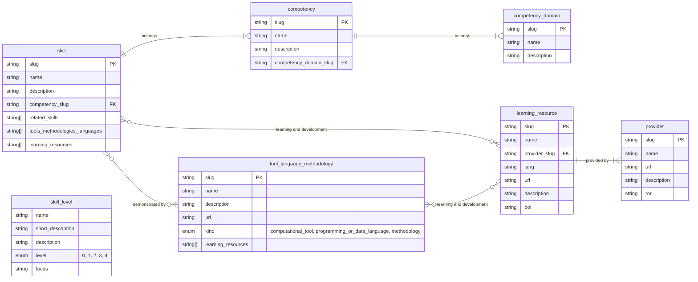
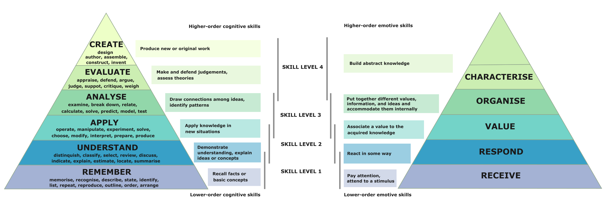

## DIRECT competency framework

Files contained in this folder represent the DIRECT framework dataset.

- [Definitions of terms](./terminology.md) - shared language for use across various user communities
- [Competency domains](./#competencies-domains--competencies) - high-level thematic grouping of related competencies that together represent a broad area of professional capability.
- [Competencies](./#competencies-domains--competencies) - integrated set of skills - knowledge, behaviours and professional practices - required to perform effectively in a defined context.
- [Skills](#skills) - specific, learnable and demonstrable behaviours or ability to perform tasks to an expected standard and guided by certain community values or practices.
- [Skill levels](skill_levels) - degree of proficiency, autonomy or awareness demonstrated in applying a skill (performing a task or a behaviour).
- [Tools, languages and methodologies](./tool_language_methodology.csv) - demonstrators of skills.
- [Learning resources](./learning_resource.csv) - materials or activities that help individuals develop skills or learn to use tools, languages, and methodologies relevant to their role or specialty.

## Data model

The framework data model is shown below.

### Competencies domains & competencies

**Competency domains** are high-level thematic grouping of related competencies that together represent a broad area of professional capability.

**Competencies are** integrated set of skills - knowledge, behaviours and professional practices - required to perform effectively in a defined context.

There are 20 competencies in the framework organised in 7 competency domains.

- **Information and data technologies**
	- Data engineering
 	- Data science and analytics	 	
- **Software design and development**
	- Software engineering
	- Web and mobile app development
 	- User Interface / User Experience (UI/UX) design 
- **Computing infrastructures and systems**
	- General systems infrastructure
 	- Web infrastructure
  	- HPC infrastructure
  	- Cloud infrastructure
- **Domain expertise and research**
	- Domain knowledge
 	- Research skills
- **Professional and people skills**
	- Personal skills
 	- Interpersonal skills
  	- Teamwork
- **Communication**
	- Verbal and written communication
 	- Community and outreach
  	- Teaching and learning 
- **Leadership and management**
	- People and team management
 	- Programme and project management
  	- Leadership

Competency domains data is available in [CSV format](./competency_domain.csv) and [JSON format](./competency_domain.json).
Competencies data is available in [CSV format](./competencies.csv) and [JSON format](./competencies.json).

### Skills

**Skills** are specific, learnable and demonstrable behaviours or ability to perform tasks to an expected standard and guided by certain community values or practices.

The DIRECT framework includes both technical and non-technical skills: 

- **technical skills** cover discipline-related expertise such as programming, data analysis, software engineering, use of digital infrastructures (e.g. HPC and cloud), reproducible research practices
- **non-technical** skills encompass broader professional competencies and behaviours that enable effective practice and collaboration, including cognitive and reflective abilities (analysis, problem-solving, creativity, self-reflection), emotional and interpersonal skills (empathy, conflict resolution, cultural awareness), professional and personal maturity (time management, adaptability, resilience, ethical integrity), and social awareness and systems thinking (EDIA, mental health awareness, business acumen).

There is over 180 skills in the framework - they are best explored through the [DIRECT webapp][direct-webapp].

Skills data is available in [CSV format](./skills.csv) and [JSON format](./skills.json).

### Skill levels

We define the following 4-level skill scale.
Skill levels data is available in [CSV format](./skill_levels.csv) and [JSON format](./skill_levels.json).

#### Level 0 - None or N/A

No skill or ability demonstrated, or the skill is not required or applicable to the role.

#### Level 1 - Awareness (technical) or self-awareness (non-technical)

*Fundamental awareness (basic knowledge) or fundamental ability*

- Technical: has basic knowledge of the area and understands core techniques and concepts;  
can follow instructions and perform simple tasks with support, but the application of the skill is limited.
- Non-technical: recognises the importance of the skill, shows initial effort, and applies it inconsistently or only in simpler contexts.

Focus: **learning** and **remembering**.

#### Level 2 - Working (technical) or self-regulating (non-technical)

*Emerging ability and/or limited experience*

- Technical: has the level of experience gained in a classroom or as a trainee on-the-job;
applies the skill with some independence in familiar situations, still needs guidance when applying the skill but can draw on a range of reference materials;
understands and can discuss terminology, concepts, principles, and issues related to this skill.
- Non-technical: understands the principles and issues; begins to reflect on practice and adapt behaviour.

Focus: developing **understanding** and gaining independence through practice.

#### Level 3 - Practitioner (technical) or applying towards others (non-technical)

*Practical application by a competent (intermediate to advanced) practitioner*

- Technical: applies skills confidently across a range of tasks; 
adapts existing solutions to challenges and supports peers; 
may occasionally require expert guidance; 
understands and can discuss the application and implications of changes to processes and policies in the skill area; 
contributes to reference and resource materials.
- Non-technical: consistently applies the skill with confidence; 
demonstrates maturity, self-reflection, and constructive collaboration and interaction with others; 
communicates effectively with varied audiences to enhance understanding and foster shared practice.

Focus: **applying** established practices, adapting to challenges, and deepening expertise and skill.

#### Level 4 – Expert (technical) or leads systemic change (non-technical)

*Leading and/or being a recognised authority or expert*

- Technical: highly skilled and independent; 
handles complex and unfamiliar challenges; 
recognised as an authority in the skill area, often mentoring others. 
creates new applications, contributes to or leads the development of reference and resource materials, and integrates the skill into wider systems, projects, or organisations.
- Non-technical: demonstrates exemplary use of the skill, adapting flexibly to complex or sensitive situations;
mentors others, shapes cultural or systemic improvements, and applies the skill to influence organisational or sector-wide practices.

Focus: designing new solutions, setting strategy, and shaping organisational or systemic direction through **analysis**, **evaluation**, and **creation**.

#### Practical application of skills levels

##### Competency wheels

We use the skills scale for (self-)assessment and to create competency wheels (personalised skill profiles) within the [DIRECT webapp][direct-webapp] - a practical implementation of the DIRECT framework.

##### Professional development & curriculum design 

The skills scale can also support curriculum design and planning for professional and personal development.
To strengthen the connection with development pathways, the scale is mapped to [Bloom’s Taxonomy][blooms-taxonomy], which defines hierarchical learning objectives for both [cognitive][blooms-taxonomy-cognitive-image] (knowledge-based, typically applied to technical skills) and [affective][blooms-taxonomy-affective-image] (emotion-based, typically applied to non-technical skills) domains.

Like our scale, Bloom’s Taxonomy progresses from lower-order processes such as *remembering* and *understanding* to higher-order processes such as *evaluating* and *creating* (e.g. in the context of cognitive skills).
Mapping our scale to Bloom's Taxomony can support the design of curricula and the formulation of learning objectives aligned with each skill level.
The correspondence between our skill levels and Bloom’s hierarchical levels is approximate, as some overlap exists between levels - someone assessed at a lower skill level may already demonstrate elements of higher-order thinking from the level above.

*Four skill levels mapped to the revised Bloom's taxonomy of cognitive and emotional skills (adapted from the [revised Bloom's taxomony diagram][revised-blooms-taxonomy-image] and [Bloom's taxonomy without text image][blooms-taxonomy-without-text], both from Wikimedia Commons)*

## References & Inspiration

* [UK Government Science and Engineering: Career Framework][gse-framework]
* [UK Government Digital and Data Profession Capability Framework][ddat-framework]
* [NIH Competencies Proficiency Scale][nih-framework]
* [BCS's SFIA (Skills Framework for the Information Age) guiding principles][sfia-guide] and [SFIA overview][sfia-framework]

[gse-framework]: https://assets.publishing.service.gov.uk/media/61a605f2e90e07043d677dd0/gse-career-framework-v2.pdf
[ddat-framework]: https://ddat-capability-framework.service.gov.uk/
[direct-framework]: ./skills-competencies-framework.json
[nih-framework]: https://hr.nih.gov/working-nih/competencies/competencies-proficiency-scale
[sfia-guide]: https://sfia-online.org/en/about-sfia/sfia-guiding-principles
[sfia-framework]: https://sfia-online.org/en/about-sfia/sfia-overview-for-new-users-211014.pdf
[blooms-taxonomy]: https://en.wikipedia.org/wiki/Bloom's_taxonomy
[revised-blooms-taxonomy-image]: https://en.wikipedia.org/wiki/Bloom's_taxonomy#/media/File:Bloom's_revised_taxonomy.svg
[blooms-taxonomy-cognitive-image]: https://upload.wikimedia.org/wikipedia/commons/thumb/7/72/BloomsTaxonomy.png/500px-BloomsTaxonomy.png
[blooms-taxonomy-affective-image]: https://upload.wikimedia.org/wikipedia/commons/thumb/7/7a/BloomsTaxonomy-Affective_01.png/500px-BloomsTaxonomy-Affective_01.png
[direct-webapp]: https://directframework.com
[blooms-taxonomy-without-text]: https://commons.wikimedia.org/wiki/File:Bloom-en_taxonomia_without_text.svg
