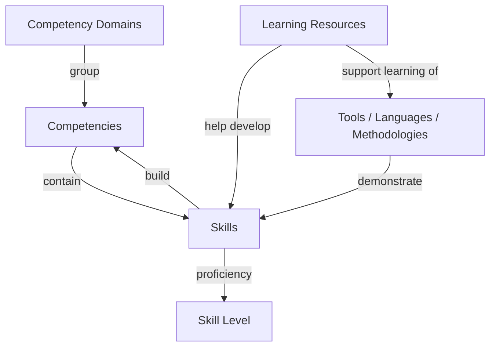

---
config:
  theme: base
  themeVariables:
    background: "#edf1f5"
    primaryColor: "#CEE398"
    secondaryColor: "#F6F9FC"
---

## DIRECT competency framework diagram

```mermaid
flowchart TD
CD[Competency Domains]
C[Competencies]
S[Skills]
SL[Skill Level]
TLM[Tools / Languages / Methodologies]
LR[Learning Resources]

CD -- group --> C
C -- contain --> S
S -- build --> C
S -- proficiency --> SL
TLM -- demonstrate --> S
LR -- help develop --> S
LR -- support learning of --> TLM
```
