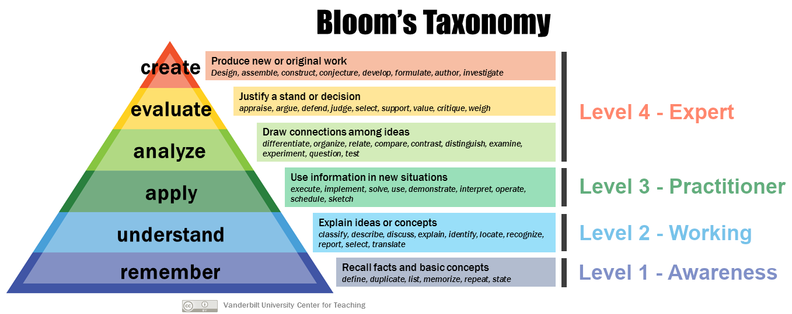

# DIRECT Framework - Skill Level Definitions

## Introduction

This document defines a skill scale as part of the [DIRECT Competency Framework][direct-framework]. 
It provides a structured way for digital research technical professionals (dRTPs) to describe their ability in a given skill. 
The scale sets out the expected proficiency at each level, from basic awareness to advanced expertise. 
It helps individuals compare their current proficiency with higher levels, identify development goals, and understand what top performers typically demonstrate at each stage.

The DIRECT framework skills that dRTPs draw on can be broadly divided into technical and non-technical: 

- **technical skills** cover discipline-related expertise such as programming, data analysis, software engineering, use of digital infrastructures (e.g. HPC and cloud), reproducible research practices
- **non-technical** skills encompass broader professional competencies that enable effective practice and collaboration, including cognitive and reflective abilities (analysis, problem-solving, creativity, self-reflection), emotional and interpersonal skills (empathy, conflict resolution, cultural awareness), professional and personal maturity (time management, adaptability, resilience, ethical integrity), and social awareness and systems thinking (EDIA, mental health awareness, business acumen).

Our skills scale is designed to apply equally well to both technical and non-technical skills. 

## Skills Scale

We use the following 4-level skill scale, aligned with the [UK Government Science and Engineering (GSE) Career Framework][gse-framework] and consistent with the [UK Government's Digital, Data and Technology (DDaT) Capability Framework][ddat-framework].

### Level 0 - None or N/A

No skill or ability demonstrated, or the skill is not required or applicable to the role.

### Level 1 - Awareness

*Fundamental awareness (basic knowledge) or fundamental ability*

- Technical: has basic knowledge of the area and understands core techniques and concepts;  
can follow instructions and perform simple tasks with support, but the application of the skill is limited.
- Non-technical: recognises the importance of the skill, shows initial effort, and applies it inconsistently or only in simpler contexts.

Focus: **learning** and **remembering**.

### Level 2 - Working

*Novice (limited experience) or emerging ability*

- Technical: has the level of experience gained in a classroom or as a trainee on-the-job;
applies the skill with some independence in familiar situations, still needs guidance when applying the skill but can draw on a range of reference materials;
understands and can discuss terminology, concepts, principles, and issues related to this skill.
- Non-technical: understands the principles and issues; begins to reflect on practice and adapt behaviour.

Focus: developing **understanding** and gaining independence through practice.

### Level 3 - Practitioner

*Intermediate practitioner (practical application)*

- Technical: applies skills confidently across a range of tasks; 
adapts existing solutions to challenges and supports peers; 
may occasionally require expert guidance; 
understands and can discuss the application and implications of changes to processes and policies in the skill area; 
contributes to reference and resource materials.
- Non-technical: consistently applies the skill with confidence; 
demonstrates maturity, self-reflection, and constructive collaboration and interaction with others; 
communicates effectively with varied audiences to enhance understanding and foster shared practice.

Focus: **applying** established practices, adapting to challenges, and deepening expertise and skill.

### Level 4 – Expert

*Advanced practitioner, expert or recognised authority*

- Technical: highly skilled and independent; 
handles complex and unfamiliar challenges; 
recognised as an authority in the skill area, often mentoring others. 
creates new applications, contributes to or leads the development of reference and resource materials, and integrates the skill into wider systems, projects, or organisations.
- Non-technical: demonstrates exemplary use of the skill, adapting flexibly to complex or sensitive situations;
mentors others, shapes cultural or systemic improvements, and applies the skill to influence organisational or sector-wide practices.

Focus: designing new solutions, setting strategy, and shaping organisational or systemic direction through **analysis**, **evaluation**, and **creation**.

## Practical Application

The skills scale can support curriculum design and planning for professional and personal development within the DIRECT framework.

To strengthen the professional and personal development link, the scale is mapped to [Bloom’s Taxonomy][blooms-taxonomy], which describes hierarchical learning objectives for cognitive (knowledge-based, useful for technical skills) and affective (emotion-based, useful for non-technical skills) development.
Bloom’s Taxonomy moves from lower-order processes such as remembering and understanding to higher-order processes such as evaluating and creating.
This mapping can support the design of curricula and the definition of learning objectives at each skill level.

*Bloom's taxonomy - image adapted from Wikimedia Commons images*

## References & Inspiration

* [UK Government Science and Engineering: Career Framework][gse-framework]
* [UK Government Digital and Data Profession Capability Framework][ddat-framework]
* [NIH Competencies Proficiency Scale][nih-framework]
* [BCS's SFIA (Skills Framework for the Information Age) guiding principles][sfia-guide] and [SFIA overview][sfia-framework]

[gse-framework]: https://assets.publishing.service.gov.uk/media/61a605f2e90e07043d677dd0/gse-career-framework-v2.pdf
[ddat-framework]: https://ddat-capability-framework.service.gov.uk/
[direct-framework]: ./skills-competencies-framework.json
[nih-framework]: https://hr.nih.gov/working-nih/competencies/competencies-proficiency-scale
[sfia-guide]: https://sfia-online.org/en/about-sfia/sfia-guiding-principles
[sfia-framework]: https://sfia-online.org/en/about-sfia/sfia-overview-for-new-users-211014.pdf
[blooms-taxonomy]: https://en.wikipedia.org/wiki/Bloom's_taxonomy
